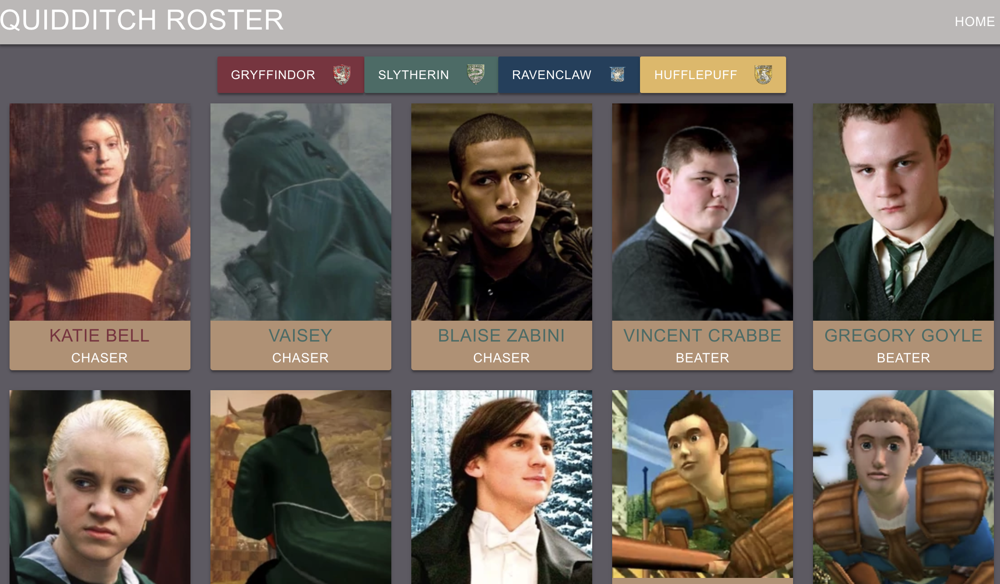

# The Quidditch Roster

## Description
This was an intense in-class code-along practice exercise to create an app that displays cards for quidditch players, and filters by House. The app is interesting because it uses multiple types of data (players, teams, houses), and component-based JavaScript. This project also introduces Sass styling and Firebase. Once the app is loaded, the user has the ability to filter the list of players by the house they belong to.

This exercise was mostly copy and paste from what the instructors had already coded. As such, I cannot take any credit for any of the code in this repository.

## Technologies Used
* Sass
* Webpack
* Axios
* ES6 Modules

## How to run this app
Note: To run this app you will need a firebase account and a new project.

### 1. Configure Firebase
1. Clone the repository to your local machine.
2. Run the following command in terminal to download the web dependencies: `npm install`
3. In the db folder, rename apiKeys.json.example to apiKeys.json.
4. In Firebase, create a new project.
5. Navigate to your config object, and copy the keys from Firebase into the apiKeys.json file.
6. Create a realtime databse in Firebase, and start in test mode.
7. Import the `./db/tasks.json` file into the database to seed data.

### 2. Serve up the app
* Run `npm start` in your terminal to initiate the app.

## Primary Contributors
* [Zoe Ames](https://github.com/zoeames)
* [Callan Morrison](https://github.com/morecallan)

##### Junior Contributor (but not really)
* [Marshall Offutt](https://github.com/marshalloffutt)
